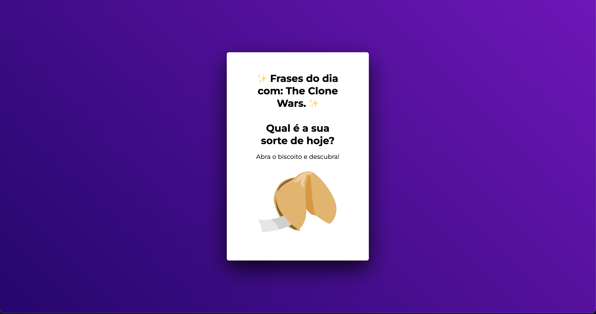
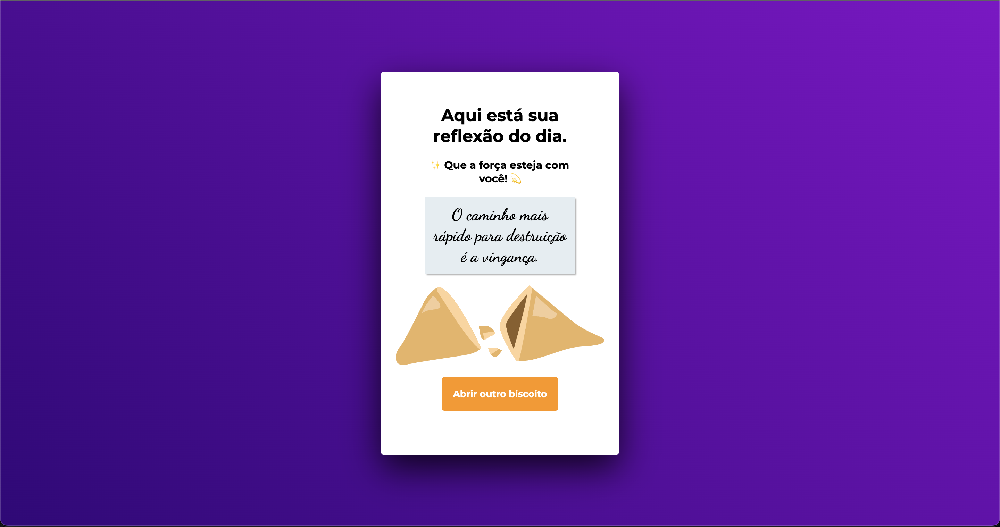
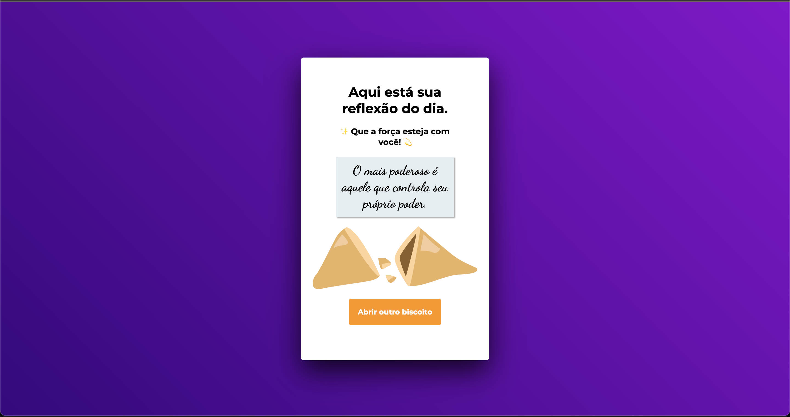
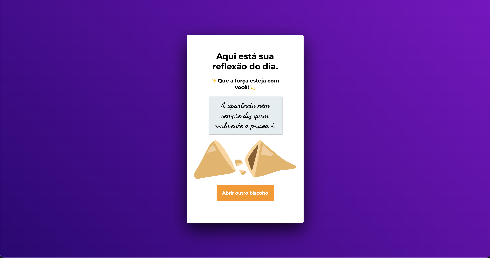

# 🥠 **Biscoito da sorte** (com JavaScript)
🥠 **Fortune cookie** (with JavaScript)

# 📸 **Screenshot:**
 

# 🚀 **Technologies**

🇺🇸 EN: **T**his project was developed with the following technologies:

🇧🇷 PT-BR: **E**sse projeto foi desenvolvido com as seguintes tecnologias:

- [HTML](##HTML)
- [CSS](##CSS)
- [JavaScript](##JavaScript)
- [Git e Github](##GiteGithub)
- [Figma](##Figma)

# 👩🏻‍💻 **Project:**

🇺🇸 **D**ata structure in HTML
Animations in CSS
Functions in JS
DOM manipulation
JS Math() Library
Callback function
Arrays

🇧🇷 **E**strutura de dados HTML
Animações com CSS
Funções no Javascript
Manipulação da DOM
Biblioteca JS Math()
Funções callback
Arrays

# 📖 **Concepts:**

🇺🇸 **I**n this project, the idea is to click on the fortune cookie and receive a message. I made an array for the phrases and used the JS math() library to bring a randomic phrase everytime the button is clicked. There were some new challenges regarding the use o JS to manipulate HTML structure and improve my logic skills. 
Project made in Rocketseat's course "Explorer". 
The layout was sent via Figma.

🇧🇷 **N**este projeto a ideia é clicar no biscoito da sorte e receber uma mensagem. Para isso, criei uma array para as frases e usei o JS Math() para inserir frases randomicamente cada vez que o biscoito é clicado. Houveram novos desafios em relação a manipulação de dados do html com o javascript e também ajudou a melhorar a minha lógica de programação. 
O layout para consulta foi enviado através da plataforma Figma. 
Projeto feito no curso Explorer da Rocketseat. 

#
## 🗓 
⏳ July 2023  
⌛️ August 2023 

#
🔎 Link: 
  
🇺🇸 - [Online project here.](http://127.0.0.1:5500/index.html)
 
🇧🇷 - [Projeto online aqui.](http://127.0.0.1:5500/index.html)
#

By Bianca Mós 💜

--------------------------------------------------------